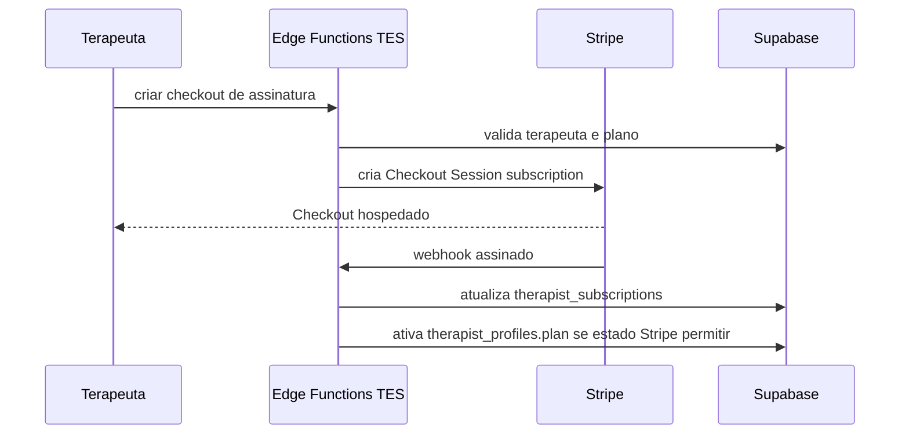
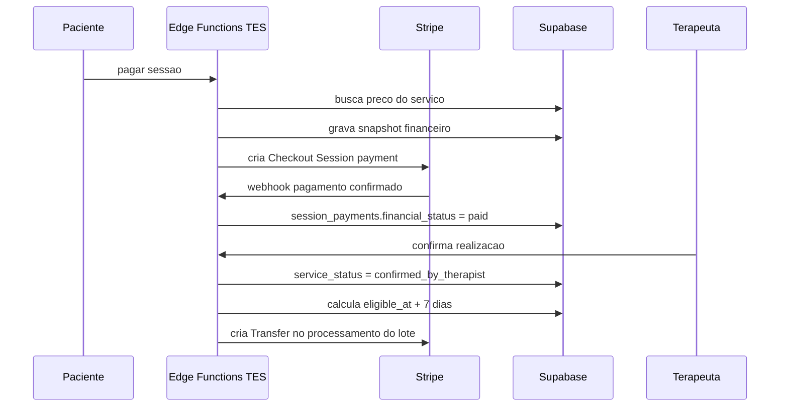

# Arquitetura de pagamentos TES

Atualizado em 2026-07-25.

## Visao geral

O TES separa dois fluxos Stripe:

- Stripe Billing: assinatura mensal dos terapeutas nos planos `premium` e `premium_plus`.
- Stripe Connect: cobranca de sessoes na conta da plataforma, com separate charges and transfers e repasse posterior ao terapeuta.

O redirecionamento do Checkout nunca ativa plano nem confirma pagamento sozinho. O estado local muda por webhooks assinados e idempotentes.

## Configuracao Connect

- Dashboard: Express.
- Fee collection: your platform manages pricing.
- Negative balance liability: your platform.
- Charge pattern: separate charges and transfers.
- Capacidade esperada para repasse: `configuration.recipient.capabilities.stripe_balance.stripe_transfers.status = active`.

Essa configuracao permite reter fundos antes de liberar repasse. Como a plataforma paga as taxas Stripe nesse fluxo, a taxa nao e descontada dos 80% devidos ao terapeuta.

## Modelo financeiro inicial

- Moeda: BRL.
- Dinheiro em centavos inteiros.
- Comissao TES: `2000` basis points.
- Terapeuta: `floor(gross_amount_cents * 8000 / 10000)`.
- TES: valor bruto menos valor do terapeuta.
- Taxa Stripe: custo da TES, conciliado posteriormente por Charge/Balance Transaction.

As regras ficam em `financial_policy_versions`. A versao inicial e `tes-payments-v1`:

- cancelamento gratuito ate 24h antes da sessao;
- cancelamento tardio: 50% retido e 50% reembolsado;
- no-show: 50% retido e 50% reembolsado;
- reembolsos antes de lote/transferencia podem ser automaticos; casos ja loteados, transferidos, disputados ou contestados entram em revisao manual;
- confirmacao automatica da sessao apos 30 dias;
- prazo de seguranca de 7 dias apos confirmacao antes de elegibilidade para repasse;
- lote semanal terca-feira 10:00 America/Sao_Paulo, com cutoff explicito e periodo unico por indice idempotente;
- upgrades de assinatura cobram prorrata imediatamente; downgrades e cancelamentos entram no fim do periodo.

## Dados principais

- `billing_plans` e `billing_plan_prices`: catalogo local de planos e Price IDs Stripe.
- `stripe_customers`: Customer local por perfil, papel e ambiente.
- `therapist_subscriptions`: assinatura paga do terapeuta.
- `therapist_connect_accounts`: conta conectada e status operacional.
- `session_payments`: fonte financeira canonica das sessoes.
- `session_payment_attempts`: tentativas idempotentes de cobranca.
- `session_refunds`, `session_cancellation_decisions` e `session_disputes`: eventos compensatorios, decisoes de politica e bloqueios.
- `session_service_confirmations`: prova de realizacao da sessao.
- `payout_batches`, `payout_batch_therapists`, `payout_batch_items`: lote semanal.
- `stripe_transfers` e `stripe_transfer_reversals`: repasses e compensacoes.
- `financial_ledger_entries`: ledger auditavel.
- `stripe_webhook_events`: recebimento idempotente de webhooks.

## Estados

Pagamento da sessao:

- `pending`, `processing`, `paid`, `failed`, `canceled`, `partially_refunded`, `refunded`, `disputed`.

Realizacao do servico:

- `scheduled`, `occurred_pending_confirmation`, `confirmed_by_patient_review`, `confirmed_by_therapist`, `auto_confirmed`, `contested`, `canceled`, `not_performed`.

Repasse:

- `not_eligible`, `waiting_confirmation`, `waiting_safety_period`, `eligible`, `batched`, `transfer_pending`, `transferred`, `blocked`, `reversed`, `failed`.

## Fluxos





## Edge Functions

Billing:

- `stripe-sync-billing-catalog`
- `stripe-create-subscription-checkout`
- `stripe-change-therapist-subscription`
- `stripe-cancel-therapist-subscription`
- `stripe-create-billing-portal`
- `stripe-billing-webhook`

Connect:

- `stripe-connect-create-account`
- `stripe-connect-create-account-link`
- `stripe-connect-create-login-link`
- `stripe-connect-sync-account`
- `stripe-connect-webhook`

Sessoes e repasses:

- `stripe-create-session-payment`
- `request-session-cancellation`
- `confirm-session-by-therapist`
- `auto-confirm-sessions`
- `evaluate-transfer-eligibility`
- `create-weekly-payout-batch`
- `process-payout-batch`
- `retry-failed-payout-items`
- `reconcile-stripe-transfers`

## Execucao local

1. Configure secrets em `supabase/functions/.env.local`.
2. Rode Supabase local e functions:

```bash
npx supabase start
npm run dev:functions
```

3. Valide ambiente:

```bash
npm run payments:env
npm run payments:env -- catalog
npm run payments:env -- platform-webhook
```

4. Sincronize catalogo:

```bash
npm run payments:catalog:sync
npm run payments:catalog:verify
```

5. Encaminhe webhooks:

```bash
npm run payments:webhooks:listen
```

## Webhooks tratados

- `checkout.session.completed`
- `customer.subscription.created`
- `customer.subscription.updated`
- `customer.subscription.deleted`
- `invoice.paid`
- `invoice.payment_failed`
- `invoice.payment_action_required`
- `payment_intent.succeeded`
- `payment_intent.payment_failed`
- `payment_intent.canceled`
- `charge.refunded`
- `charge.dispute.created`
- `charge.dispute.updated`
- `charge.dispute.closed`
- `account.updated` no webhook Connect

## Secrets Stripe

- `STRIPE_SECRET_KEY`: unica chave usada pelas Edge Functions e scripts de catalogo. Aceita chave secreta `sk_*` ou chave restrita `rk_*`; rejeita chave publicavel `pk_*`. O modo `test`/`live` e inferido da propria chave.
- `STRIPE_WEBHOOK_SECRET`: fallback local para os webhooks de plataforma e Connect.
- `STRIPE_PLATFORM_WEBHOOK_SECRET`: segredo especifico do endpoint de Billing/sessoes, preferido em staging/producao.
- `STRIPE_CONNECT_WEBHOOK_SECRET`: segredo especifico do endpoint Connect, preferido em staging/producao.
- `PAYMENTS_INTERNAL_OPERATIONS_TOKEN`: token apenas machine-to-machine para rotinas privadas de cron/ops. O catalogo pode ser sincronizado pelo script local sem esse token.

Nao usar `STRIPE_RESTRICTED_API_KEY` nem `STRIPE_ENVIRONMENT` neste projeto. O app Next.js nao deve receber secret Stripe.

O fallback de `STRIPE_WEBHOOK_SECRET` existe para desenvolvimento local. Em staging/producao, configurar `STRIPE_PLATFORM_WEBHOOK_SECRET` e `STRIPE_CONNECT_WEBHOOK_SECRET` separadamente; se o fallback for usado, a Edge Function registra alerta operacional sem imprimir o secret.

## Pendencias comerciais

- Tratamento fiscal e emissao de nota.
- Regras de excecao manual para casos de terapeuta responsavel por cancelamento ou remarcacao especial.

## Recuperacao operacional

- Webhooks com `processing_status = failed` podem ser reprocessados por rotina administrativa futura usando `stripe_event_id`.
- Pagamentos sem taxa Stripe conciliada devem ser encontrados por `stripe_fee_amount_cents is null`.
- Sessoes bloqueadas aparecem por `transfer_status = blocked` e `transfer_blocked_reason`.
- Transfers com falha aparecem por `stripe_transfers.status = failed` e `payout_batch_items.status = failed`.
