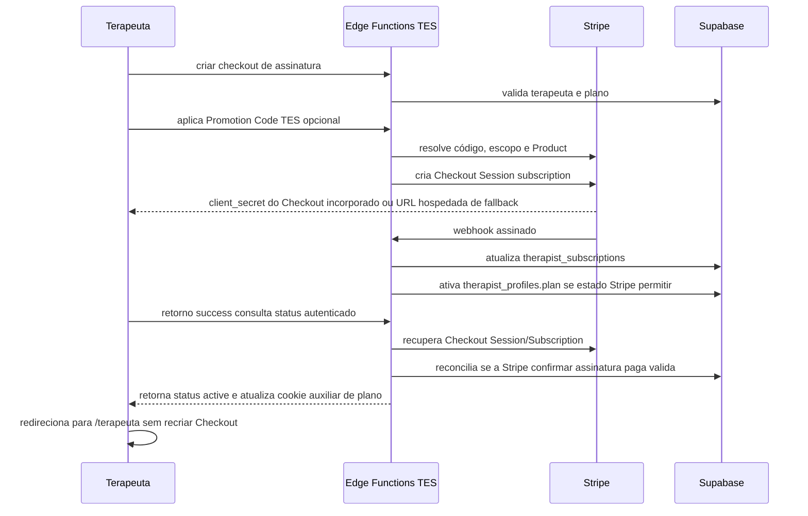
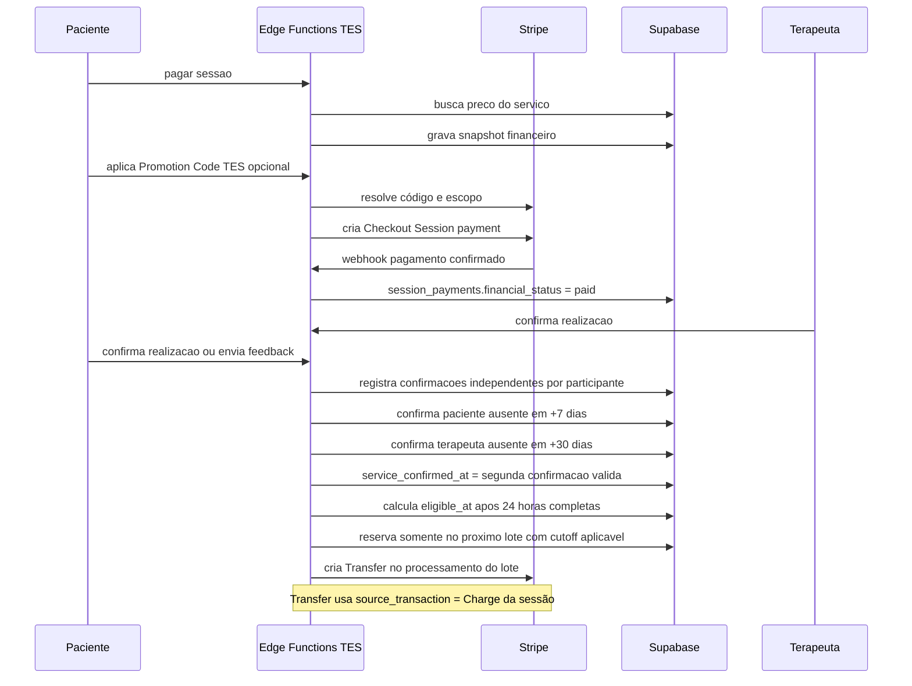

# Arquitetura de pagamentos TES

Atualizado em 2026-08-26.

## Visao geral

O TES separa dois fluxos Stripe:

- Stripe Billing: assinaturas mensais dos terapeutas nos planos `premium` e
  `premium_plus`, com Checkout incorporado como fluxo principal e Checkout
  hospedado como contingencia.
- Stripe Connect: cobranca de sessoes na conta da plataforma, com separate charges and transfers e repasse posterior ao terapeuta.

O redirecionamento do Checkout nunca ativa plano nem confirma pagamento sozinho.
O estado local muda por webhooks assinados, reservados atomicamente e
idempotentes. Quando o retorno chega antes do webhook, a tela chama uma rota
autenticada de status que recupera a Checkout Session e a Subscription
diretamente na Stripe, valida `customer`, `client_reference_id`, metadata,
ambiente e Price ID, e aplica a mesma sincronizacao idempotente usada pelo
webhook. O parametro `checkout=success` continua sem autoridade propria.

## Rotas de retorno

- `/terapeuta/*` e o destino canonico de Checkout, Billing Portal e Connect.
- `/basico/*`, `/pro/*` e `/plus/*` nao devem ser fixados em Edge Functions;
  os retornos existentes foram migrados na Fase Agenda 1.
- A URL de retorno melhora a continuidade da jornada, mas nunca concede plano,
  capability, pagamento ou autorizacao.
- `/terapeutas/*` continua reservado ao catalogo publico.

## Configuracao Connect

- Dashboard: Express.
- Fee collection: your platform manages pricing.
- Negative balance liability: your platform.
- Charge pattern: separate charges and transfers.
- Pais de identidade da conta conectada: `identity.country = br`.
- Entidade inicial do onboarding hospedado: `identity.entity_type = individual`.
- Capacidade esperada para repasse: `configuration.recipient.capabilities.stripe_balance.stripe_transfers.status = active`.
- A plataforma brasileira tambem solicita
  `configuration.merchant.capabilities.card_payments.requested = true` na
  criacao Accounts v2 porque a Stripe exige essa capability antes de aceitar
  `stripe_balance.stripe_transfers`. Isso nao muda o charge pattern do TES:
  sessoes continuam como cobranca na plataforma com separate charges and
  transfers, e o terapeuta nao recebe formulario local de cobranca.

Se a Stripe retornar `account_create_activation_required`, a plataforma Live
ainda nao foi ativada para criar contas conectadas. A Edge Function traduz esse
bloqueio em estado temporario de habilitacao, sem criar registro local de conta
nem apresentar erro tecnico ao terapeuta. A ativacao precisa ser concluida no
Stripe antes de novos cadastros de recebimento.

Essa configuracao permite reter fundos antes de liberar repasse. Como a plataforma paga as taxas Stripe nesse fluxo, a taxa nao e descontada dos 85% devidos ao terapeuta em novos pagamentos sob a política vigente.

## Modelo financeiro inicial

- Moeda: BRL.
- Dinheiro em centavos inteiros.
- Comissao TES para novos pagamentos: `1500` basis points (15%).
- Terapeuta: `floor(gross_amount_cents * 8500 / 10000)`.
- TES: valor bruto menos valor do terapeuta.
- Taxa Stripe: custo da TES, conciliado posteriormente por Charge/Balance Transaction.

Quando uma Promotion Code da Stripe reduz o Checkout, o valor financeiro
autoritativo da sessão é `Checkout Session.amount_total`, não o preço original
do booking. O subtotal original, o desconto e o valor cobrado são preservados
no `session_payments.metadata.stripe_checkout`; o campo
`session_payments.gross_amount_cents` e a divisão entre TES/terapeuta são
reconciliados no webhook sobre o valor efetivamente cobrado. Sem desconto, os
valores continuam iguais aos snapshots do booking.

Uma campanha de sessão pode reduzir o total a zero com desconto percentual de
100% ou valor fixo exatamente igual ao subtotal. Nesse caso a Stripe cria uma
Checkout Session sem cobrança/PaymentIntent, e o webhook assinado confirma o
pagamento lógico da reserva; comissão, repasse e taxa Stripe ficam em zero.
Descontos que excedam o subtotal são recusados para impedir valor negativo.

O campo promocional é TES e fica fora do Embedded Checkout. Coupon define o
benefício; Promotion Code define o texto público e carrega
`tes_checkout_scope=session|subscription`. A Edge Function resolve o código na
Stripe e cria uma nova Checkout Session com `discounts.promotion_code`; não há
catálogo local. Assinaturas exigem também `Coupon.applies_to.products`
explícito. Todos os Checkouts usam `locale=pt-BR`. Regras operacionais e
homologação estão em `docs/payments/promotion-codes.md`.

As regras ficam em `financial_policy_versions`. As versões financeiras são
preservadas no snapshot de cada pagamento. A versão operacional vigente para
novos pagamentos é `tes-payments-v8-commission-15-percent`; as versões
anteriores, inclusive a v7 com 20%, continuam disponíveis para interpretar
pagamentos já criados:

- cancelamento gratuito ate 24h antes da sessao;
- cancelamento com menos de 24h: não há obrigação de reembolso; situações
  excepcionais podem ser analisadas individualmente pelo TES;
- não comparecimento: não há obrigação de reembolso, ressalvadas situações
  excepcionais analisadas pelo TES;
- reembolsos antes de lote/transferencia podem ser automaticos; casos ja loteados, transferidos, disputados ou contestados entram em revisao manual;
- confirmação automática da resposta ausente do paciente após 7 dias;
- confirmação automática da resposta ausente do terapeuta após 30 dias;
- prazo de segurança de 24 horas completas após a segunda confirmação válida;
- lote semanal terça-feira às 02:00 America/Sao_Paulo, com cutoff explícito e período único por índice idempotente;
- upgrades de assinatura cobram prorrata imediatamente; downgrades e cancelamentos entram no fim do periodo.
- Premium Plus para Premium cria Subscription Schedule e registra o plano/data
  futuros na metadata da assinatura local e remota para projeção consistente.
- cancelamento usa `cancel_at_period_end`, libera eventual schedule de
  downgrade e preserva o plano efetivo ate o fim pago; a mesma funcao aceita
  reversao autenticada e idempotente com `cancel_at_period_end = false`.

A política v8 herda da v7 as regras de confirmação bilateral. Ela exige respostas independentes do
paciente e do terapeuta. O prazo de cada papel começa em `bookings.ends_at`:
o paciente vence em 7 dias e o terapeuta em 30 dias. A confirmação automática
usa o vencimento contratual como `confirmed_at`, mesmo quando o job recupera
uma execução atrasada; `created_at` preserva o instante real da execução.

`service_confirmed_at` é o instante da segunda confirmação com resultado
`completed`, calculado pelo maior `confirmed_at` entre os dois papéis. Somente
então `eligible_at` é definido para 24 horas completas depois. O pagamento não
é transferido nesse instante: ele apenas pode entrar no próximo lote cujo
`cutoff_at` seja igual ou posterior a `eligible_at`.

Se qualquer participante responder `not_performed`, o feedback privado fica
imutável, o repasse é bloqueado e uma ocorrência administrativa é aberta. O
job não cria respostas automáticas enquanto houver relato negativo ou
cancelamento, reembolso, disputa, contestação ou bloqueio administrativo. A
contraparte ainda pode responder manualmente. Uma decisão administrativa
`performed_confirmed` inicia uma nova segurança de 24 horas na data da decisão;
`not_performed_confirmed` mantém o bloqueio e segue o contrato de
cancelamento/reembolso.

Pagamentos abertos, ainda não confirmados e não reservados em lote recebem a
nova política. Confirmações, lotes e transferências históricas são preservados.
Após a aprovação, o processamento de reembolso deve começar em até 7 dias
úteis, sem garantir o prazo de crédito do meio de pagamento.

A presença confirmada pelos eventos confiáveis do Zoom é evidência operacional
e sinal de risco, não é requisito para o prazo automático nem autorização de
repasse. Feedback, confirmações e divergências não escrevem diretamente em
ledger, transferências ou lotes. Mesmo após a confirmação bilateral, o lote
exige pagamento confirmado, ausência de reembolso/disputa/bloqueio, conta
Connect apta, valor positivo e as demais regras financeiras vigentes.

O feedback privado da sessão e a avaliação pública do terapeuta são contratos
distintos. A avaliação pública é uma relação paciente–terapeuta editável,
enquanto o feedback privado é uma resposta imutável por participante e sessão.
Criar, editar, ocultar ou republicar `reviews` não altera `bookings`,
`session_payments`, elegibilidade ou lotes.

## Dados principais

- `billing_plans` e `billing_plan_prices`: catálogo local mensal de planos e
  Price IDs Stripe. O Product Premium Plus possui um Price público e pode
  compartilhar um Price oculto de oferta. `is_public` impede ofertas especiais
  de aparecerem no catálogo; `offer_key` só é resolvido no backend a partir de
  metadata confiável da Stripe.
- `stripe_customers`: Customer local por perfil, papel e ambiente.
- `therapist_subscriptions`: assinatura paga do terapeuta.
- `therapist_connect_accounts`: conta conectada e status operacional.
- `session_payments`: fonte financeira canonica das sessoes.
- `session_payment_attempts`: tentativas idempotentes de cobranca.
- `session_refunds`, `session_cancellation_decisions` e `session_disputes`: eventos compensatorios, decisoes de politica e bloqueios. Cancelamento usa `request_id` único e o RPC `claim_session_cancellation_decision_v1` (somente `service_role`) para registrar uma única decisão antes de chamar Stripe; retries reutilizam a decisão, a chave de idempotência do refund e a transição do booking.
- `session_service_confirmations`: prova de realizacao da sessao.
- `session_participant_confirmations`: respostas canônicas por papel, com
  `source`, `due_at`, `confirmed_at` e snapshot da política.
- `session_feedback`: retorno privado e imutável por participante/sessão.
- `session_confirmation_incidents`: divergências e decisões administrativas.
- `session_confirmation_scheduler_runs`: auditoria horária por papel e falhas.
- `payout_batches`, `payout_batch_therapists`, `payout_batch_items`: lote semanal.
- `stripe_transfers` e `stripe_transfer_reversals`: Transfer da plataforma para o saldo conectado e compensações.
- `stripe_payouts`: Payout automático criado pela Stripe, separado do ledger.
- `stripe_payout_transfer_allocations`: atribuição única de cada Transfer ao
  Payout por Balance Transaction; lotes e Payouts derivam relação
  muitos-para-muitos.
- `payout_scheduler_runs` e `payout_operational_incidents`: lease semanal, auditoria, bloqueios e reconciliação.

> Decisão BR (ADR-018): o TES controla o Transfer semanal e a Stripe executa
> Payout automático `daily`. A associação bancária não usa metadata de Payout;
> usa `destination_payment` e `balance_transactions?payout=...`. A política v5
> e o cron permanecem inativos até homologação HML completa.

- `financial_ledger_entries`: ledger auditavel.
- `stripe_webhook_events`: recebimento idempotente de webhooks.

Desde o Gate F0:

- `session_payments` atualiza `payments`, `bookings.payment_status` e
  `booking_payment_receipts` por projeção transacional;
- `service_role` não escreve diretamente em `payments`;
- registros legados são importados de forma idempotente e ficam bloqueados para
  repasse até a reconciliação recuperar o Charge de origem;
- o plano da assinatura é resolvido pelo `stripe_price_id` efetivo, nunca apenas
  pela metadata enviada ao Checkout.
- falha ou expiração de tentativa superseded não altera o pagamento atual; um
  sucesso real de tentativa anterior é aceito e expira as tentativas irmãs.

Agenda e Sessões:

- `therapist_session_read_model_v1` lê estado financeiro e realização
  diretamente de `session_payments`;
- divergência em `bookings.payment_status` não autoriza acesso Zoom;
- filtros financeiros de Sessões usam `session_financial_status`;
- o frontend não escreve estado financeiro nem confirma pagamento por
  redirect.

## Estados

Pagamento da sessao:

- `pending`, `processing`, `paid`, `failed`, `canceled`, `partially_refunded`, `refunded`, `disputed`.

Realizacao do servico:

- canônico novo: `scheduled`, `occurred_pending_confirmation`,
  `confirmed_bilateral`, `contested`, `canceled`, `not_performed`;
- somente para leitura histórica: `confirmed_by_patient_review`,
  `confirmed_by_therapist` e `auto_confirmed`.

Repasse:

- `not_eligible`, `waiting_confirmation`, `waiting_safety_period`, `eligible`, `batched`, `transfer_pending`, `transferred`, `blocked`, `reversed`, `failed`.

## Fluxos





## Edge Functions

Billing:

- `stripe-sync-billing-catalog`
- `stripe-create-subscription-checkout`
- `stripe-subscription-checkout-status`
- `stripe-change-therapist-subscription`
- `stripe-cancel-therapist-subscription`
- `stripe-create-billing-portal`
- `stripe-billing-webhook`

Connect:

- `stripe-connect-create-account`
- `stripe-connect-create-account-link`
- `stripe-connect-create-login-link`
- `stripe-connect-sync-account`
- `stripe-connect-webhook`

Sessoes e repasses:

- `session-booking-checkout`
- `session-reschedule`
- `stripe-create-session-payment`
- `request-session-cancellation`
- `confirm-session-by-therapist`
- `auto-confirm-sessions`
- `evaluate-transfer-eligibility`
- `create-weekly-payout-batch`
- `process-payout-batch`
- `retry-failed-payout-items`
- `reconcile-stripe-transfers`
- `weekly-payout-scheduler`
- `stripe-connect-payout-schedule`

`session-booking-checkout` é a fronteira autenticada da reserva pública:
exige paciente derivado da sessão, `serviceId`, `startsAt`, `requestId` e
aceite obrigatório dos termos. O checkout de sessão usa Stripe Embedded
Checkout: `stripe-create-session-payment` cria a Checkout Session server-side e
retorna apenas o `clientSecret` necessário para montar o componente oficial da
Stripe. O retorno visual da Stripe não confirma pagamento; somente webhook
assinado atualiza `session_payments` e o booking.

## Shell financeiro do terapeuta

F0/F1 implementa `/terapeuta/financeiro` com quatro abas: Resumo,
Recebimentos, Repasses e Conta de recebimento. A tela é operacional e
disponível para Free, Premium e Premium Plus quando houver movimentação
financeira.

F2 adiciona métricas intermediárias na aba Resumo para Premium e Premium Plus
via `advanced_metrics`: receita líquida comparada ao período anterior, ticket
médio, sessões pagas/realizadas, retorno simples, cancelamentos,
reagendamentos, faturamento por terapia e evolução financeira realizada versus
período anterior. Free continua com o resumo operacional.

F3 adiciona o dashboard avançado Premium Plus via `advanced_financials`:
previsão do mês, potencial disponível da agenda, oportunidade do mês, Insight
TES determinístico, retenção por coorte, evolução com projeção, ranking
detalhado por terapia. Benchmark não é exibido na experiência financeira do
terapeuta. Realizado, contratado e estimado permanecem separados; projeções não
criam ledger, saldo ou repasse.

F4 fecha o ciclo operacional em test mode: conta Connect ativa, pagamento de
sessao confirmado exclusivamente por webhook Stripe, reconciliacao do Charge,
confirmacao da realizacao, periodo de seguranca controlado somente por flag
server-side de teste, elegibilidade, criacao de lote, Transfer com
`source_transaction`, conclusao do repasse, dashboard atualizado e
comprovantes/reconciliacao visiveis. O retorno da Stripe continua sem autoridade
para confirmar pagamento, onboarding ou repasse.

Read models privados:

- `get_private_therapist_financial_overview_v1`;
- `get_private_therapist_receipts_v1`;
- `get_private_therapist_payouts_v1`;
- `get_private_therapist_bank_payouts_v1`;
- `get_admin_payout_operations_v1`;
- `get_private_therapist_connect_account_v1`;
- `get_private_therapist_financial_metrics_v1` para métricas F2 Premium e
  Premium Plus;
- `get_private_therapist_advanced_financial_dashboard_v1` e contratos
  segmentados F3 para Premium Plus.

Todos derivam terapeuta de `auth.uid()`, retornam centavos inteiros e não
expõem linhas cruas. O frontend formata valores, mas não calcula saldos
autoritativos. Conta de recebimento usa Stripe Connect hospedado; retorno da
Stripe pede sincronização e nunca marca onboarding como concluído.

Documentos de contrato:

- `docs/payments/therapist-finance-f0-f1.md`;
- `docs/architecture/adr/ADR-013-therapist-finance-f2-metrics.md`;
- `docs/architecture/adr/ADR-014-therapist-finance-f3-advanced-dashboard.md`;
- `docs/architecture/adr/ADR-015-therapist-finance-f4-operational-payout-lifecycle.md`.
- `docs/architecture/adr/ADR-017-weekly-transfer-payout-orchestration.md`.
- `docs/architecture/adr/ADR-018-weekly-transfer-daily-automatic-payout.md`.
- `docs/payments/weekly-payouts.md`.

## Execucao local

1. Configure secrets em `supabase/functions/.env.local`.
2. Rode Supabase local e functions:

```bash
npx supabase start
npm run dev:functions
```

3. Valide ambiente:

```bash
npm run payments:env
npm run payments:env -- catalog
npm run payments:env -- platform-webhook
```

4. Sincronize catalogo:

```bash
npm run payments:catalog:sync
npm run payments:catalog:verify
```

5. Encaminhe webhooks:

```bash
npm run payments:webhooks:listen
```

Para homologacao conjunta de pagamento de sessao e Zoom Video SDK, use:

```bash
npm run homologation:zoom:local
```

O orquestrador captura o signing secret do Stripe CLI sem imprimi-lo e o injeta
somente no processo local das Edge Functions. A sessao Zoom real fica bloqueada
ate haver evidencia nao secreta de `checkout.session.completed`/PaymentIntent
processado, `session_payments.financial_status = paid` e `video_sessions`
criada pelo fluxo canonico.

Runbooks complementares:

- `docs/payments/stripe-secrets-setup.md`: obtencao e rotacao de secrets Stripe.
- `docs/payments/internal-operations-token.md`: geracao, uso, teste e rotacao do token machine-to-machine.

## Webhooks tratados

Configuracao detalhada para o Dashboard Stripe:
`docs/payments/stripe-secrets-setup.md`.

`stripe-billing-webhook`, escopo `Sua conta`:

- `checkout.session.completed`
- `checkout.session.async_payment_succeeded`
- `checkout.session.async_payment_failed`
- `checkout.session.expired`
- `customer.subscription.created`
- `customer.subscription.updated`
- `customer.subscription.deleted`
- `invoice.paid`
- `invoice.payment_failed`
- `invoice.payment_action_required`
- `invoice.finalization_failed`
- `payment_intent.processing`
- `payment_intent.requires_action`
- `payment_intent.succeeded`
- `payment_intent.payment_failed`
- `payment_intent.canceled`
- `charge.refunded`
- `refund.created`
- `refund.updated`
- `refund.failed`
- `charge.dispute.created`
- `charge.dispute.updated`
- `charge.dispute.closed`
- `transfer.updated`
- `transfer.reversed`

`stripe-connect-webhook`, escopo `Contas conectadas`, payload snapshot:

- `account.updated`

`stripe-connect-webhook`, escopo `Sua conta`, payload thin Accounts v2. Para
Accounts v2 que representam contas Connect, esse é o escopo emissor de
`v2.core.account.*`; o destino snapshot v1 permanece em `Contas conectadas`:

- `v2.core.account.created`
- `v2.core.account.updated`
- `v2.core.account.closed`
- `v2.core.account[configuration.merchant].updated`
- `v2.core.account[configuration.merchant].capability_status_updated`
- `v2.core.account[configuration.recipient].updated`
- `v2.core.account[configuration.recipient].capability_status_updated`
- `v2.core.account[defaults].updated`
- `v2.core.account[identity].updated`
- `v2.core.account[requirements].updated`
- `v2.core.account[future_requirements].updated`

### Encerramento de conta Connect

`v2.core.account.closed` é terminal para a conta corrente do terapeuta. O
webhook a torna histórica e mantém seus snapshots, Transfers e Payouts para
reconciliação. Somente itens reservados que ainda não possuem Transfer voltam
para elegibilidade na plataforma; eles aguardam uma nova conta corrente pronta.
Nunca há redirecionamento automático de Transfer, Payout ou saldo entre contas
Connect. Eventos posteriores de atualização da conta histórica não podem
reativá-la.

## Secrets Stripe

- `STRIPE_SECRET_KEY`: unica chave usada pelas Edge Functions e scripts de catalogo. Aceita chave secreta `sk_*` ou chave restrita `rk_*`; rejeita chave publicavel `pk_*`. O modo `test`/`live` e inferido da propria chave.
- `STRIPE_WEBHOOK_SECRET`: fallback local para os webhooks de plataforma e Connect.
- `STRIPE_PLATFORM_WEBHOOK_SECRET`: segredo especifico do endpoint de Billing/sessoes, preferido em staging/producao.
- `STRIPE_CONNECT_WEBHOOK_SECRET`: segredo especifico do endpoint Connect, preferido em staging/producao.
- `STRIPE_CONNECT_V2_WEBHOOK_SECRET`: segredo do destino thin de Accounts v2.
- `PAYMENTS_INTERNAL_OPERATIONS_TOKEN`: token apenas machine-to-machine para rotinas privadas de cron/ops. O catalogo pode ser sincronizado pelo script local sem esse token.

Nao usar `STRIPE_RESTRICTED_API_KEY` nem `STRIPE_ENVIRONMENT` neste projeto. O app Next.js nao deve receber secret Stripe.

O fallback de `STRIPE_WEBHOOK_SECRET` existe para desenvolvimento local. Em
staging/producao, configurar `STRIPE_PLATFORM_WEBHOOK_SECRET`,
`STRIPE_CONNECT_WEBHOOK_SECRET` e `STRIPE_CONNECT_V2_WEBHOOK_SECRET`
separadamente; se um fallback for usado, a Edge Function registra alerta
operacional sem imprimir o secret.

## Documentos e escopo fiscal

O TES, nesta versao, nao emite nota fiscal. Para cobranca e comprovacao de pagamento, sao utilizadas invoices e recibos gerados pela Stripe. Esses documentos nao devem ser apresentados como substitutos de nota fiscal.

Assinaturas de terapeutas usam invoices do Stripe Billing, com `hosted_invoice_url`, PDF da invoice ou Billing Portal quando disponiveis. Pagamentos de sessoes usam recibos da Charge/PaymentIntent, incluindo `receipt_url` quando a Stripe gerar esse comprovante. Transfers Connect e payouts bancarios sao comprovantes operacionais distintos e tambem nao sao notas fiscais.

Nao implementar, nesta etapa, integracao com prefeitura, emissor fiscal, NFS-e nacional ou emissao em nome dos terapeutas. A fronteira futura deve permanecer desacoplada do dominio financeiro.

## Pendencias comerciais

- Validacao contabil/juridica antes de qualquer emissao fiscal futura.
- Regras de excecao manual para casos de terapeuta responsavel por cancelamento ou remarcacao especial.

## Recuperacao operacional

- Webhooks com `processing_status = failed` podem ser reprocessados por rotina administrativa futura usando `stripe_event_id`.
- Pagamentos sem taxa Stripe conciliada devem ser encontrados por `stripe_fee_amount_cents is null`.
- Sessoes bloqueadas aparecem por `transfer_status = blocked` e `transfer_blocked_reason`.
- Transfers com falha aparecem por `stripe_transfers.status = failed` e `payout_batch_items.status = failed`.
- Pagamentos importados sem Charge ficam com
  `transfer_blocked_reason = source_charge_reconciliation_required` e são
  resolvidos por `reconcile-stripe-transfers`.
- Controles temporais de teste (`nowOverride` e `cutoffAtOverride`) exigem
  `TES_FINANCE_TEST_CONTROLS_ENABLED=true`, Stripe em `test` mode e token
  interno valido; em live mode falham fechado.
- Repasses conciliados devem carregar `stripe_transfer_id` e
  `stripe_source_charge_id`, permitindo verificar que o Transfer foi criado com
  `source_transaction`.
