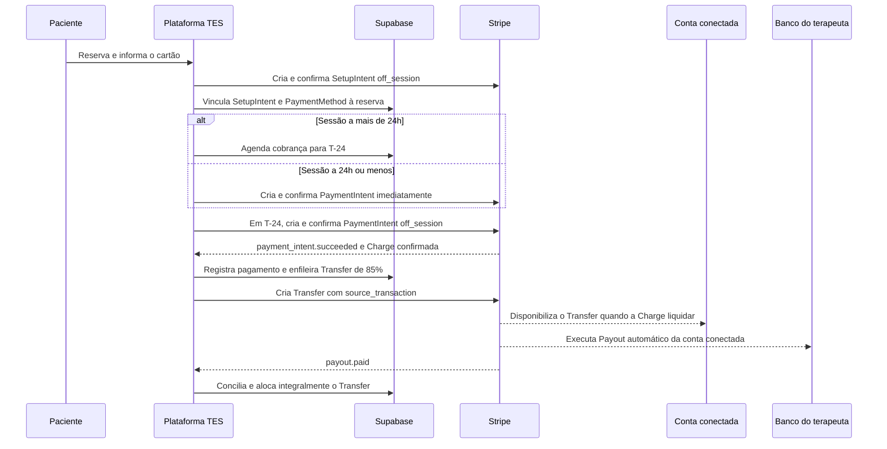

# Plano de implementação do fluxo financeiro de sessões V10

| Campo              | Valor                                                                                                                                                                                                                                                                                                                                                  |
| ------------------ | ------------------------------------------------------------------------------------------------------------------------------------------------------------------------------------------------------------------------------------------------------------------------------------------------------------------------------------------------------ |
| Status             | **Aprovado para implementação**                                                                                                                                                                                                                                                                                                                        |
| Política           | `tes-payments-v10-setup-t24-immediate-transfer`                                                                                                                                                                                                                                                                                                        |
| Escopo             | Plano do novo fluxo financeiro de sessões. As Fases 1 a 6 estão implementadas e homologadas localmente. A Fase 7 está em homologação no HML; uma correção local identificada pelo canário ainda aguarda novo PR antes do fechamento do gate. A estabilização e a drenagem segura das obrigações V9 permanecem em andamento. Produção não foi alterada. |
| Atualização        | Setembro de 2026                                                                                                                                                                                                                                                                                                                                       |
| Meios de pagamento | Cartões de crédito e débito aceitos pela Stripe para a conta TES no Brasil                                                                                                                                                                                                                                                                             |
| Modelo Connect     | Separate Charges and Transfers, em BRL                                                                                                                                                                                                                                                                                                                 |

## 1. Objetivo

Este documento divide em fases a implementação do novo fluxo financeiro de
sessões do TES. Ele cobre reserva, preparação do cartão, cobrança, Transfer,
Payout, conciliação, reembolso, compensação de débitos, promoções, Zoom,
notificações, interfaces financeiras, métricas, observabilidade e rollout.

O documento orienta as fases futuras. Em setembro de 2026, o núcleo das Fases 1
a 4 foi implementado somente no ambiente local: fundação versionada, reserva por
SetupIntent, cobrança T-24, recuperação autenticada do mesmo PaymentIntent e
bloqueio operacional da sala, Transfer direto imediato com Charge de origem,
compensação de dívida, retry manual e conciliação com Payout automático. A
Fase 5 foi concluída localmente com o cancelamento e o reagendamento de agendamentos
ainda não cobrados: apenas schedules intactos, sem tentativa ou PaymentIntent,
podem ser cancelados ou substituídos atomicamente; o reagendamento preserva o
SetupIntent e o PaymentMethod da reserva, substitui o schedule anterior e deixa
exatamente um schedule ativo com vencimento em T-24 do novo horário. Estados
ambíguos ou posteriores continuam direcionados ao suporte. A Fase 5 também
possui, somente no Docker local, decisão administrativa de reembolso integral,
bloqueio prévio da sessão, tentativa única de recuperação do valor enviado ao
terapeuta, solicitação de reembolso ao cliente e registro de dívida quando a
recuperação não é possível. A conciliação local dos eventos Stripe de Refund e
Transfer Reversal usa RPCs transacionais V10, com identificadores individuais
e lançamentos idempotentes. Valores parciais observados fora do TES continuam
representáveis para auditoria, mas o comando TES não os oferece. O gate local
foi fechado com uma cobrança de cartão fora da sessão do navegador, repasse
vinculado de 85%, recuperação integral do repasse, reembolso integral, entrega
assinada dos eventos e navegação autenticada de administrador, paciente e
terapeuta. A Fase 6 foi concluída localmente com a adequação dos estados
terminais, dos read models V9/V10, das métricas, das páginas e da comunicação.
A leitura local já distingue a compensação total de um depósito:
o item aparece como “Compensado”, com líquido bancário zero, sem inflar os
totais em processamento nem o gráfico. A migration local
`20260914190000_merge_v10_direct_transfer_payout_history.sql` unifica lotes V9
e repasses diretos V10 na paginação, sem duplicar valores, sem tratar
compensação total como depósito e sem enviar identificadores da Stripe ao
navegador. “Pago” continua exigindo a confirmação bancária integralmente
conciliada; uma movimentação apenas criada permanece “A caminho do banco”. A
migration local
`20260914193000_fix_v10_payout_processing_after_offsets.sql` faz o card e a
linha do tempo “Em processamento” usarem, no V10, o valor efetivamente enviado
depois de compensações, sem alterar a posição histórica V9. A homologação no
IAB confirmou um cenário determinístico de R$ 100,00 bruto, R$ 15,00 de custos
da plataforma, R$ 10,00 de compensação e R$ 75,00 a caminho do banco; resumo,
linha do tempo, filtro e histórico exibiram os mesmos R$ 75,00, sem
identificadores do provedor nem linguagem interna.
A migration local
`20260914200000_session_financial_flow_v10_admin_projection.sql` incorpora ao
painel administrativo o estado bancário, a compensação e o valor efetivamente
encaminhado. A migration complementar
`20260914201500_unify_admin_payout_projection_v9_v10.sql` aplica a mesma
semântica segura ao histórico V9: “Pago” exige repasse bancário conciliado e
alocado integralmente; uma movimentação criada permanece “A caminho do banco”.
No IAB autenticado, lista e detalhe administrativos exibiram separadamente
R$ 85,00 previstos, R$ 10,00 compensados e R$ 75,00 encaminhados. A data do
pagamento do cliente ficou explicitamente separada da data de pagamento ao
banco. O catálogo de e-mails, a recuperação de pagamento e os alertas
financeiros foram revisados para usar somente linguagem de produto, inclusive
quando o banco exige confirmação ou outro cartão.
A
migration local
`20260914183000_session_financial_flow_v10_feedback_projection.sql` separa
o estado das confirmações bilaterais do envio do repasse V10 e impede que a
elegibilidade semanal V9 reclassifique um pagamento V10; a trilha de relato
negativo e resolução administrativa está coberta por regressão de banco, mas
os read models, métricas e comunicações correspondentes foram cobertos pelo
gate local da Fase 6.
Em 14/09/2026, os três destinos webhook ativos de HML foram conferidos na
Stripe Test e apontam para o host exato do projeto de homologação, com matrizes
de 27 eventos da plataforma, 8 eventos Connect snapshot e 11 eventos Accounts
v2 thin. Na Fase 7, a entrega assinada do `checkout.session.completed` de uma
reserva V10 futura foi observada, com SetupIntent vinculado à reserva e agenda
de cobrança criada sem antecipação do pagamento. A configuração dos destinos,
isoladamente, não substitui a evidência de cada evento crítico do fluxo.
Em 15/09/2026, um segundo canário avançado de forma controlada comprovou uma
cobrança de R$ 123,00, exatamente um Transfer de R$ 104,55, conta conectada
congelada correta e vínculo com a Charge original. O evento assinado
`payment_intent.succeeded` foi entregue sem pendência e registrado uma única
vez no HML. A homologação também revelou que o worker persistia o horário local
de execução como se fosse o horário do provedor; o evento assinado, criado
antes, era então descartado como antigo e não completava meio de pagamento,
recibo e evidência de liquidação. A correção usa o instante `created` do próprio
PaymentIntent e falha fechado se ele estiver ausente ou inválido. Essa correção
está apenas no repositório local e precisa de novo PR, implantação em HML e novo
canário antes do fechamento da Fase 7.
O mesmo ciclo de homologação encontrou uma navegação circular no reingresso de
um Checkout expirado: a tela de sucesso enviava para a área de encontros, mas a
lista voltava à tela de sucesso e o detalhe não oferecia a ação já autorizada
pela RPC. A correção local faz a lista abrir o detalhe canônico e só mostra
`Continuar pagamento` quando a resposta autenticada contém `canRetry=true` para
o mesmo booking. O IAB confirmou a ação, a mensagem simples e a URL correta no
frontend local conectado ao HML, sem clicar no controle nem criar outra
tentativa financeira. Essa correção também aguarda PR e novo aceite em HML.
As
rotas legadas de cancelamento e reagendamento delegam os casos V10 pré-cobrança
aos comandos transacionais próprios e recusam as demais mutações V10 com
orientação ao suporte. Em HML, a política V10 e os workers de cobrança e repasse
estão ativos para novas reservas. A política e o scheduler V9 foram desativados
para novas aquisições, mas os registros e as obrigações históricas V9 permanecem
preservados para reconciliação e drenagem controlada. Produção não foi alterada.
A existência deste arquivo não autoriza deploy, alteração remota, execução de
cron ou movimentação financeira.

O artefato de ativação dos workers V10 está versionado em
`supabase/schedules/session-financial-flow-v10.sql`. Ele registra, com
pré-condições de Vault e política ativa, os jobs de um minuto para
`process-session-charges` e `process-session-transfers`. O script não é uma
migration e não é executado no reset do Docker. Em HML, sua execução foi
autorizada e validada na Fase 7; produção continua condicionada a autorização
operacional separada.

## 2. Decisão financeira aprovada

O fluxo V10 será:

1. Na reserva, o TES salva e autentica o cartão por `SetupIntent`, com
   `usage=off_session` e consentimento explícito para a cobrança futura daquela
   sessão.
2. Se a sessão estiver a mais de 24 horas, o TES agenda a cobrança para
   `starts_at - 24 horas`.
3. Se a sessão estiver a 24 horas ou menos, o TES cobra imediatamente durante a
   reserva.
4. A cobrança integral nasce na conta Stripe da plataforma TES.
5. Quando a Stripe confirmar o pagamento e existir uma Charge válida, o TES
   registra o pagamento canônico e cria imediatamente um Transfer de 85% para a
   conta conectada congelada na reserva.
6. O Transfer usa a Charge original em `source_transaction`. Assim, pode ser
   criado enquanto os fundos da Charge ainda estão pendentes e será executado
   pela Stripe quando esses fundos ficarem disponíveis.
7. Os 15% restantes constituem a receita bruta contratual do TES. As tarifas da
   Stripe são custo do TES e não reduzem os 85% do terapeuta na política V10.
8. O Payout da conta conectada para o banco segue o cronograma automático
   aplicável à conta Stripe do terapeuta.
9. Para o terapeuta, o repasse somente pode ser apresentado como pago no banco
   após `payout.paid`, conciliação concluída e alocação integral do Transfer.
10. Confirmação, avaliação e presença da sessão permanecem como evidências de
    atendimento e suporte, mas não autorizam nem bloqueiam automaticamente a
    criação do Transfer V10.

## 3. Motivo da criação imediata do Transfer

Separate Charges and Transfers separa Charge, Transfer e Payout. A cobrança do
cliente nasce na plataforma; o Transfer movimenta a parcela do terapeuta para a
conta conectada; o Payout envia o saldo Stripe da conta conectada ao banco.

O V10 não aguardará a realização da sessão para criar o Transfer. A conta TES
também pode ter Payout automático. Se a Charge ficar disponível e sua parcela
não estiver vinculada a um Transfer por `source_transaction`, o saldo poderá
seguir no Payout da plataforma. Um Transfer posterior poderia então falhar por
saldo insuficiente.

O `source_transaction` resolve essa corrida: a Stripe aceita o Transfer
associado à Charge mesmo antes de os fundos ficarem disponíveis e posterga sua
execução até a disponibilidade da origem. A confirmação de atendimento deixa
de ser gate financeiro, sem deixar de existir como evidência operacional.

## 4. Escopo e limites

### 4.1 Incluído

- Cartões de crédito e débito habilitados na conta Stripe TES.
- Reservas novas criadas após a ativação explícita da política V10.
- `SetupIntent` e `PaymentMethod` vinculados à reserva e à sua versão.
- Cobrança automática em T-24 ou imediata quando a sessão estiver a 24 horas ou
  menos.
- Recuperação de cobrança recusada ou que exija ação do paciente.
- Transfer de 85% imediatamente após pagamento confirmado, com
  `source_transaction`.
- Payout automático da conta conectada e conciliação bancária.
- Promoções, inclusive total zero.
- Cancelamento, reagendamento, reembolso, Transfer Reversal e compensação de
  débito do terapeuta.
- Bloqueio da sala quando o pagamento não estiver confirmado.
- Read models, páginas, métricas, notificações, suporte e operação
  administrativa afetados.
- Compatibilidade e convivência entre V9 e V10.

### 4.2 Fora do escopo

- Pix, boleto, débito em conta ou outros meios assíncronos.
- Alterar o percentual contratual de 85%/15%.
- Controlar ou prometer a data bancária do Payout da Stripe.
- Criar ciclos de Transfer nos dias 5 e 20 para pagamentos V10.
- Migrar ou reescrever pagamentos, lotes, Transfers ou ledger históricos V9.
- Alterar o desenho visual do checkout, os holds de agenda ou regras de
  disponibilidade fora do necessário para o novo contrato financeiro.
- Automatizar decisão de suporte sobre sessão não realizada.
- Alterar produção antes dos gates de homologação e autorização operacional.

## 5. Invariantes

1. `session_payments` continua sendo a fonte financeira canônica da sessão.
2. Dinheiro é persistido somente em centavos inteiros; percentuais usam basis
   points e snapshots imutáveis.
3. Nenhum estado retornado pelo navegador confirma SetupIntent, pagamento,
   Transfer, reembolso, conta Connect ou Payout.
4. Webhooks assinados e reconciliação autenticada são as autoridades dos
   estados Stripe.
5. Toda criação externa usa chave de idempotência derivada da reserva, versão e
   operação. Repetição não pode criar cobrança, Transfer ou reembolso duplicado.
6. Cada reserva V10 guarda seu próprio vínculo
   `Reserva -> SetupIntent -> PaymentMethod`. Uma nova reserva não substitui o
   cartão congelado de outra reserva.
7. O navegador nunca envia valor, comissão, conta conectada, Customer,
   PaymentIntent, Charge ou Transfer como autoridade.
8. O `connect_account_id` escolhido para o futuro Transfer é congelado na
   reserva. Mudanças posteriores de conta não redirecionam silenciosamente uma
   obrigação existente.
9. O Transfer V10 não depende de `payout_batches` nem de
   `payout_batch_items`.
10. Transfer e Payout são eventos distintos. Criar o Transfer não significa que
    o valor chegou ao banco.
11. Reembolso de uma Charge não reverte automaticamente seu Transfer. O TES
    deve solicitar a reversão de forma explícita e conciliar os dois objetos.
12. Ledger é append-only. Correções usam lançamentos compensatórios.
13. O status de atendimento, a confirmação e a avaliação não alteram
    diretamente pagamentos, Transfers ou ledger.
14. O acesso ao Zoom exige pagamento confirmado ou total lógico zero, além dos
    gates operacionais próprios do Zoom.
15. Falha de infraestrutura nunca pode ser apresentada como recusa de cartão ou
    sucesso aparente.
16. A interface final não exibe nomes de tabelas, jobs, webhooks, lotes,
    arquitetura, erros internos ou termos de desenvolvimento.

## 6. Regras de negócio por momento

| Momento                | Regra V10                                                                                                                                                                        | Resultado persistido                                                  |
| ---------------------- | -------------------------------------------------------------------------------------------------------------------------------------------------------------------------------- | --------------------------------------------------------------------- |
| Reserva acima de 24h   | Criar e confirmar `SetupIntent` com `usage=off_session`, consentimento explícito e Customer da plataforma.                                                                       | Cartão preparado e cobrança agendada para T-24.                       |
| Reserva a 24h ou menos | Coletar o cartão e criar a cobrança imediatamente.                                                                                                                               | Reserva só segue como paga após confirmação Stripe.                   |
| Promoção parcial       | Validar o Promotion Code server-side e congelar subtotal, desconto, total e regra usada.                                                                                         | A cobrança futura usa o valor congelado.                              |
| Promoção de 100%       | Não exigir cartão nem criar SetupIntent, PaymentIntent ou Transfer.                                                                                                              | Pagamento lógico zero, comissão e parcela do terapeuta iguais a zero. |
| T-24                   | Revalidar versão ativa, horário, cancelamento, valor, promoção, PaymentMethod, Customer e conta Connect congelada; depois criar e confirmar um novo `PaymentIntent` off-session. | Tentativa idempotente da cobrança daquela reserva.                    |
| Cobrança confirmada    | Persistir Charge e valores autoritativos e enfileirar imediatamente o Transfer.                                                                                                  | `session_payments.financial_status=paid` e intenção de Transfer V10.  |
| Cobrança recusada      | Registrar falha sanitizada, notificar o paciente e permitir recuperação até o início da sessão.                                                                                  | Reserva preservada; sala bloqueada.                                   |
| Autenticação exigida   | Levar o paciente a uma rota autenticada para concluir a ação sobre o mesmo PaymentIntent, quando recuperável.                                                                    | Sala bloqueada até confirmação por webhook.                           |
| Início sem pagamento   | Encerrar a possibilidade normal de cobrança, manter a sala bloqueada e encaminhar a ocorrência ao suporte conforme o estado canônico de cancelamento por pagamento.              | Reserva não concluída financeiramente.                                |
| Transfer               | Criar 85% em BRL para a conta congelada, com `source_transaction` igual à Charge da sessão.                                                                                      | Transfer rastreável por sessão, sem lote semanal.                     |
| Payout                 | Importar eventos e Balance Transactions da conta conectada.                                                                                                                      | Transfer associado a um único Payout, quando aplicável.               |
| Conciliação            | Exigir `payout.paid`, reconciliação concluída e alocação integral.                                                                                                               | Repasse exibido como pago no banco.                                   |

### 6.1 Limite de 24 horas

- `starts_at > now + 24h`: salvar cartão e agendar cobrança.
- `starts_at <= now + 24h`: cobrar imediatamente.
- O cálculo usa instante absoluto no banco; apresentação segue
  `America/Sao_Paulo`.
- O agendador deve reivindicar cobranças vencidas de forma idempotente, com
  lock/lease, e aceitar atraso operacional sem cobrar duas vezes.

### 6.2 Confirmação e avaliação da sessão

As confirmações do paciente e do terapeuta, o feedback privado, a avaliação
pública e a presença observada no Zoom continuam auditáveis. Eles apoiam
suporte, análise de qualidade e resolução de ocorrências, mas não são gates de
cobrança ou Transfer V10.

Relato de sessão não realizada não deve mover dinheiro diretamente. Ele abre a
análise operacional. Se a administração aprovar o reembolso, aplica-se o fluxo
de reversão e reembolso descrito neste documento.

## 7. Cancelamento e reagendamento

### 7.1 Cancelamento permitido antes da cobrança

Quando o cancelamento ocorrer com mais de 24 horas de antecedência e a cobrança
ainda não existir:

- cancelar atomicamente o agendamento de cobrança ativo;
- invalidar claims ainda não executados;
- não criar PaymentIntent, Refund ou Transfer;
- preservar a auditoria da reserva, da promoção e do consentimento;
- liberar o horário conforme o contrato de agenda já existente.

### 7.2 Reagendamento permitido antes da cobrança

Quando o reagendamento ocorrer com mais de 24 horas:

- criar nova versão do agendamento financeiro;
- marcar a versão anterior como substituída;
- mover `charge_due_at` para 24 horas antes do novo início;
- preservar o PaymentMethod vinculado e o snapshot promocional, desde que o
  consentimento e a política comercial continuem aplicáveis;
- nunca deixar duas versões ativas para a mesma reserva.

No contrato local implementado, a troca só é aceita quando o horário original
ainda está a mais de 24 horas, o pagamento continua pendente e o schedule está
intacto. O comando usa a mesma solicitação canônica de agenda, preserva o
`SetupIntent` e o `PaymentMethod` daquela reserva, marca o schedule anterior
como `superseded` e cria exatamente um novo schedule com a versão atual da
reserva em `expected_booking_version`. Se o novo horário estiver a 24 horas ou
menos, o novo schedule nasce vencido e fica imediatamente reivindicável pelo
worker de cobrança. Schedule já reivindicado, PaymentIntent, Charge ou Transfer
fazem a operação falhar fechada e encaminham o caso ao suporte.

### 7.3 Depois da cobrança

O cliente não pode reagendar nem cancelar autonomamente com menos de 24 horas.
Casos em que o terapeuta não compareceu ou outra regra foi infringida entram no
suporte. Uma decisão de reembolso não depende da confirmação bilateral, mas
deve ser única, auditável e idempotente.

## 8. Reembolso, reversão e débito do terapeuta

### 8.1 Ordem operacional

Para Separate Charges and Transfers, o reembolso da Charge não altera o
Transfer associado. A ordem V10 será:

1. reivindicar no banco uma única decisão financeira para a sessão;
2. calcular a parcela reversível do terapeuta e a parcela assumida pelo TES;
3. tentar `Transfer Reversal` total ou parcial com chave idempotente;
4. solicitar o reembolso da Charge ao cliente mesmo se a reversão não puder ser
   concluída;
5. conciliar de forma independente os estados do Reversal e do Refund;
6. se a reversão falhar por falta de saldo disponível/reserva na conta
   conectada, registrar o débito interno do terapeuta;
7. compensar o débito, de forma auditável, nos próximos Transfers do mesmo
   terapeuta;
8. manter tratamento contratual fora da Stripe quando não houver futuros
   recebíveis suficientes.

### 8.2 Regras do débito interno

- O débito não altera o valor bruto histórico nem apaga o Transfer original.
- Cada débito referencia a sessão, o Transfer, a decisão de reembolso e o valor
  ainda recuperável.
- A compensação ocorre antes da criação de novos Transfers V10.
- Um novo pagamento pode gerar Transfer de valor menor ou zero, conforme o
  saldo devedor, sem produzir valor negativo na Stripe.
- Cada compensação cria alocação imutável e lançamento compensatório no ledger.
- Concorrência deve bloquear o saldo do débito para impedir desconto duplicado.
- Reversão posterior bem-sucedida reduz somente o saldo ainda aberto e não pode
  recuperar duas vezes o mesmo valor.
- A interface do terapeuta deve usar linguagem contratual clara, sem expor
  detalhes internos da Stripe.

### 8.2.1 Pré-condições identificadas na auditoria local

A conciliação local V10 de `refund.*`, `charge.refunded` e
`transfer.updated/reversed` consulta os objetos Stripe e registra cada Refund e
Reversal por identificador próprio em RPCs transacionais. O comando TES aceita
somente reembolso integral de sessão. Valores parciais originados externamente
permanecem distintos e são encaminhados para análise, sem serem oferecidos como
ação normal no produto. A homologação local com Stripe Test comprovou a cadeia
integral: cartão preparado para uso futuro, cobrança fora da sessão do
navegador, Transfer vinculado de 85% enquanto os fundos ainda estavam
pendentes, reversão integral e reembolso integral. Os eventos assinados foram
entregues ao webhook local e conciliados de forma idempotente.

O comando administrativo autenticado foi exercitado contra o Docker local e a
Stripe Test. A decisão foi persistida antes das chamadas externas, a sala foi
encerrada, o reembolso integral foi conciliado e, quando o valor enviado ao
terapeuta já não podia ser recuperado naquele instante, o débito correspondente
foi reaberto para compensação futura sem dupla contabilização. A página
administrativa passou a mostrar o resultado em linguagem de produto, e as
páginas de paciente e terapeuta passaram a bloquear a sala e as ações após o
estado terminal.

O endpoint legado `request-session-cancellation` impede que casos V10 pagos
entrem na decisão V9. A barreira permanece ativa e o comando administrativo V10
faz a reivindicação persistida antes das chamadas à Stripe, separa resultado
definitivo de resposta ambígua e permite a conciliação independente do
reembolso e da recuperação do terapeuta. Nenhum reembolso V10 é declarado
concluído apenas pela resposta síncrona da API.

### 8.3 Disputas

Disputas debitam a plataforma no modelo Separate Charges and Transfers. O TES
deve bloquear novas liberações associadas, tentar recuperação por reversão
quando aplicável e usar o mesmo ledger de débito/compensação para valores não
recuperados. A implementação detalhada continua subordinada à política de
disputas existente e não autoriza automação além das decisões aprovadas.

## 9. Conta Connect

### 9.1 Congelamento na reserva

A reserva V10 só pode ser concluída com uma conta Connect corrente e apta para
receber Transfers. O identificador interno e o identificador Stripe da conta
devem ser congelados no snapshot financeiro.

### 9.2 Conta indisponível antes da cobrança

Se a conta congelada estiver encerrada, restrita ou sem capability válida no
preflight de T-24:

- não cobrar o cliente;
- não selecionar automaticamente outra conta do mesmo terapeuta;
- bloquear a sala;
- abrir ocorrência operacional deduplicada;
- orientar o suporte com informações internas sanitizadas.

### 9.3 Mudança depois da cobrança

Se a cobrança for confirmada e a conta congelada ficar indisponível antes da
criação do Transfer:

- não redirecionar a obrigação para uma conta nova;
- reconciliar primeiro qualquer resposta ambígua da Stripe;
- se o Transfer comprovadamente não existir, encaminhar para reembolso e
  suporte conforme decisão única;
- manter a sala bloqueada enquanto o pagamento não tiver destino financeiro
  seguro.

## 10. Modelo de dados planejado

Os nomes abaixo constituem o contrato proposto para as migrations V10. A Fase 1
deve confirmar colisões, índices, RLS, grants e compatibilidade antes de criar
qualquer objeto.

### 10.1 Política e snapshots

- Criar a política
  `financial_policy_versions.policy_key = tes-payments-v10-setup-t24-immediate-transfer`.
- Novas reservas V10 congelam política, percentual, valores, moeda, horário,
  terapeuta, serviço, conta Connect e promoção.
- Registros V9 preservam a política original e continuam interpretados pelos
  contratos V9.

### 10.2 Preparação do cartão

Nova tabela privada proposta: `session_payment_setups`.

Campos mínimos:

- `id`, `booking_id`, `booking_version`, `session_payment_id`;
- `stripe_environment`, `stripe_customer_id`;
- `stripe_setup_intent_id`, `stripe_payment_method_id`;
- `usage`, sempre `off_session` para cartão V10;
- `status`, `consent_version`, `consented_at`;
- `superseded_at`, `failure_code`, `created_at`, `updated_at`.

Restrições:

- unicidade por `booking_id + booking_version` para o setup ativo;
- identificadores Stripe únicos por ambiente;
- somente backend/service role lê os identificadores completos;
- nenhum dado PAN, CVC ou autenticação bancária é persistido pelo TES.

### 10.3 Agendamento e tentativas de cobrança

Nova tabela privada proposta: `session_payment_schedules`.

Campos mínimos:

- `id`, `booking_id`, `booking_version`, `session_payment_id`;
- `due_at`, `status`, `attempt_count`, `next_retry_at`;
- `lease_owner`, `lease_expires_at`, `claimed_at`;
- `stripe_payment_intent_id`, `stripe_charge_id`;
- `last_error_code`, `last_failed_at`, `succeeded_at`, `canceled_at`;
- `idempotency_key`, `request_fingerprint`, timestamps.

`session_payment_attempts` continua como trilha canônica das tentativas e deve
ser ampliada para distinguir `v10_immediate`, `v10_scheduled` e
`v10_customer_recovery`, sem apagar os tipos legados.

### 10.4 Promoções

Nova autoridade transacional proposta:
`session_promotion_reservations` e suas alocações/consumos.

Snapshot mínimo:

- Promotion Code e Coupon Stripe;
- escopo `session`, moeda, tipo e valor do desconto;
- subtotal, desconto e total em centavos;
- limites relevantes e versão da reserva;
- estado `reserved`, `consumed`, `released` ou `expired`;
- timestamps e chave idempotente.

A Stripe continua sendo a autoridade do catálogo e da validade do código. O TES
é a autoridade da reserva atômica daquele benefício para a sessão e do valor
congelado que será cobrado em T-24.

### 10.5 Transfer direto por sessão

`stripe_transfers` deve aceitar origem V10 sem lote semanal:

- tornar `payout_batch_item_id` opcional somente para Transfer direto V10;
- adicionar origem explícita, por exemplo `transfer_origin = session_direct |
weekly_batch`;
- exigir `session_payment_id` e Charge de origem para `session_direct`;
- manter `payout_batch_item_id` obrigatório para `weekly_batch`;
- unicidade de Transfer efetivo por pagamento/parcela/retry sem duplicidade;
- persistir `source_transaction`, conta congelada, valor solicitado, valor
  compensado por débito, valor transferido, fingerprint e idempotency key.

Uma check constraint deve impedir linhas sem origem válida ou com as duas
origens ao mesmo tempo. Lotes e Transfers V9 permanecem imutáveis.

Nova fila/outbox proposta: `session_transfer_jobs`.

- É criada atomicamente com a confirmação local do pagamento.
- Um worker cria o Transfer logo após o webhook.
- Um cron de recuperação curto processa jobs órfãos ou interrompidos.
- Resposta ambígua preserva a mesma chave até conciliação.
- Falha definitiva usa retry controlado e incidente, nunca loop infinito.

### 10.6 Débitos e compensações

Novas tabelas privadas propostas:

- `therapist_financial_debts`: principal, saldo aberto, origem, estado e
  terapeuta;
- `therapist_financial_debt_allocations`: valor aplicado a cada futuro
  Transfer, com vínculo ao ledger;
- `therapist_financial_debt_events`: criação, ajuste, recuperação por Reversal,
  compensação e encerramento.

RLS deve impedir leitura cruzada. Escritas são somente por rotinas
service-role/admin autorizadas. O terapeuta recebe projeção agregada e linguagem
de produto, nunca linhas operacionais internas.

### 10.7 Payout e conciliação

`stripe_payout_transfer_allocations` deve alocar tanto Transfers V9 de lote
quanto Transfers V10 diretos. A associação continua derivada de
`destination_payment` e Balance Transactions do Payout, sem depender de
metadata no Payout.

## 11. Estados planejados

### 11.1 Preparação do pagamento

`requires_setup -> processing -> succeeded`

Saídas recuperáveis/terminais:

- `requires_action`: paciente precisa concluir autenticação;
- `failed`: setup recusado ou inválido;
- `canceled`: reserva cancelada;
- `superseded`: versão substituída por reagendamento.

### 11.2 Cobrança agendada

`scheduled -> claimed -> processing -> paid`

Saídas adicionais:

- `requires_customer_action`;
- `retry_scheduled` para falha transitória;
- `failed` para recusa confirmada;
- `canceled`;
- `superseded`.

O read model deve mapear esses estados para os estados canônicos existentes de
`session_payments`: `pending`, `processing`, `paid`, `failed`, `canceled`,
`partially_refunded`, `refunded` e `disputed`.

### 11.3 Transfer

`queued -> creating -> pending_source -> transferred`

Saídas adicionais:

- `reconciliation_required` para resposta ambígua;
- `failed` para falha definitiva;
- `partially_reversed`;
- `reversed`.

`pending_source` significa Transfer criado e aguardando disponibilidade da
Charge. `transferred` não significa pagamento bancário concluído.

### 11.4 Payout bancário

Usar os estados Stripe:

- `pending`;
- `in_transit`;
- `paid`;
- `failed`;
- `canceled`.

Somente `paid` com reconciliação e alocação integrais conclui o repasse para o
terapeuta.

### 11.5 Estado da sala

- Pagamento `paid` ou total lógico zero: pagamento apto para o gate Zoom.
- `pending`, `processing`, `requires_customer_action` ou `failed`: sala
  bloqueada.
- O acesso ainda respeita janela, identidade, presença do terapeuta e demais
  contratos do Zoom.

## 12. Interfaces e Functions afetadas

### 12.1 Interfaces de paciente

- `/reserva`: preservar composição visual, campo promocional, resumo, hold e
  formulário oficial Stripe. Para reservas acima de 24h, confirmar o salvamento
  do cartão e informar de forma simples quando ocorrerá a cobrança.
- `/reserva/sucesso`: distinguir reserva confirmada com cobrança futura de
  pagamento já confirmado, sem afirmar sucesso financeiro pelo redirect.
- `/app/encontros` e detalhe do encontro: mostrar estado útil da cobrança,
  permitir ação de autenticação/novo cartão e explicar bloqueio da sala em
  linguagem de produto.
- `/app/pagamentos`: refletir agendado, em processamento, confirmado,
  reembolsado e falho sem expor termos internos.
- Sala/espera Zoom: liberar somente quando o read model autoritativo confirmar
  pagamento ou total zero.

### 12.2 Interfaces de terapeuta

- `/terapeuta/sessoes` e detalhe: separar estado de atendimento do estado
  financeiro; confirmação e avaliação não prometem nem bloqueiam Transfer.
- `/terapeuta/financeiro`: adaptar recebimentos, repasses, gráficos, filtros,
  detalhes e comprovantes para Transfers diretos V10 e lotes V9 conviventes.
- “Pago”/“Recebido” deve depender de Payout `paid` integralmente conciliado.
- Débitos compensáveis devem ser exibidos somente quando houver ação ou impacto
  financeiro real, em linguagem contratual e sem arquitetura interna.

### 12.3 Interfaces administrativas e suporte

- `/admin/pagamentos`: incluir cobrança agendada, ação requerida, Transfer
  direto, Reversal, Refund, dívida e compensações.
- Detalhe financeiro: permitir solicitar reversão e reembolso por comando
  idempotente, com confirmação explícita, autorização e trilha de auditoria.
- Se a reversão falhar por saldo insuficiente, registrar automaticamente a
  dívida aprovada sem esconder que o TES financiou o reembolso.
- Incidentes devem ser deduplicados por reserva/operação e nunca conter secrets
  ou dados de cartão.

### 12.4 Edge Functions existentes a adaptar

| Function                           | Responsabilidade V10 planejada                                                                                                                            |
| ---------------------------------- | --------------------------------------------------------------------------------------------------------------------------------------------------------- |
| `session-booking-checkout`         | Criar reserva/versionamento, congelar política, valor, promoção, conta Connect e iniciar setup ou cobrança imediata.                                      |
| `stripe-create-session-payment`    | Deixar de assumir somente Checkout `mode=payment` V9; orquestrar o contrato V10 compatível ou delegar a endpoints V10 sem quebrar reservas V9.            |
| `stripe-billing-webhook`           | Consumir eventos de plataforma de SetupIntent, PaymentIntent, Charge, Refund e Transfer; persistir idempotentemente e enfileirar Transfer após pagamento. |
| `reservation-checkout-maintenance` | Preservar hold de cinco minutos e limpar apenas bootstraps abandonados; não cancelar cobranças V10 válidas.                                               |
| `session-reschedule`               | Versionar e mover/cancelar a cobrança agendada de forma atômica.                                                                                          |
| `request-session-cancellation`     | Decidir uma vez; cancelar schedule ou executar Reversal + Refund + dívida conforme o estado.                                                              |
| `reconcile-stripe-transfers`       | Conciliar Transfer direto V10 e Transfer de lote V9 sem misturar origens.                                                                                 |
| `stripe-connect-webhook`           | Manter prontidão, encerramento e histórico da conta congelada; importar eventos de conta conectada e Payout conforme contrato.                            |
| `zoom-video-session-access`        | Exigir pagamento confirmado/zero no instante de acesso e falhar fechado.                                                                                  |
| `zoom-video-session-maintenance`   | Preservar lifecycle Zoom sem transformar confirmação de sessão em gate financeiro.                                                                        |
| `email-outbox-dispatch`            | Entregar notificações de cobrança, ação necessária, confirmação, falha, reembolso e suporte.                                                              |
| `evaluate-transfer-eligibility`    | Permanecer apenas para obrigações V9; não comandar Transfer V10.                                                                                          |
| `create-weekly-payout-batch`       | Selecionar somente V9 durante a convivência; nunca incluir pagamento V10.                                                                                 |
| `process-payout-batch`             | Processar apenas lotes V9; não ser reutilizado como autoridade de Transfer V10.                                                                           |
| `weekly-payout-scheduler`          | Continuar somente enquanto existirem obrigações V9 drenando.                                                                                              |

### 12.5 Novas Functions internas propostas

| Function                             | Contrato planejado                                                                                                         |
| ------------------------------------ | -------------------------------------------------------------------------------------------------------------------------- |
| `stripe-prepare-session-payment`     | Endpoint autenticado para criar/recuperar SetupIntent da reserva, ou iniciar a cobrança imediata quando aplicável.         |
| `charge-scheduled-session-payments`  | Worker interno que reivindica schedules vencidos, cria/confirma PaymentIntent off-session e persiste resultado sanitizado. |
| `process-session-transfers`          | Worker interno que cria o Transfer direto V10 com `source_transaction`, conta congelada, dívida compensada e idempotência. |
| `retry-session-financial-operations` | Recuperação controlada de falhas transitórias/ambíguas após reconciliação; não repete cegamente mutações Stripe.           |

Os nomes definitivos devem ser confirmados na Fase 1 para evitar duplicação de
contratos existentes. Todas as rotinas internas usam service role e token
machine-to-machine quando necessário; nunca são chamadas diretamente pelo
navegador.

### 12.6 RPCs e read models

Planejar RPCs service-role para:

- reservar/finalizar SetupIntent por versão;
- agendar, reivindicar, concluir, falhar, substituir e cancelar a cobrança;
- confirmar pagamento e criar a outbox de Transfer na mesma transação;
- reivindicar Transfer com conta e Charge congeladas;
- registrar falha ambígua, retry e reconciliação;
- criar e alocar dívida do terapeuta;
- aplicar compensação atômica antes do próximo Transfer;
- concluir Reversal/Refund sem dupla recuperação;
- abrir e deduplicar incidente operacional.

Atualizar os read models privados financeiros e administrativos para unir V9 e
V10 sem expor tabelas internas. Versões novas de RPC são preferíveis quando o
shape ou a semântica mudar; consumidores V9 não devem receber significado novo
sob o mesmo contrato silenciosamente.

## 13. Métricas e projeções

Todas as métricas devem ler a política e a origem do pagamento.

- Reserva criada não é receita recebida.
- SetupIntent concluído não é pagamento.
- Cobrança agendada entra apenas em contratado/agendado, nunca em realizado.
- PaymentIntent confirmado é pagamento do cliente, mas ainda não é recebimento
  bancário do terapeuta.
- Transfer criado com fundos pendentes aparece como repasse em processamento.
- Payout `paid` integralmente alocado compõe o realizado bancário.
- Desconto usa o total efetivo congelado; total zero não gera comissão,
  obrigação, Transfer ou taxa de cartão.
- Dívida e compensação devem aparecer separadamente do valor bruto da sessão.
- Reembolso e Reversal não podem ser somados duas vezes.
- Confirmação e avaliação continuam em métricas de atendimento, sem alterar
  métricas financeiras.
- Forecasts, resumo, recebimentos, repasses e admin devem suportar V9/V10 na
  mesma janela sem duplicidade.

## 14. Notificações e linguagem de produto

Eventos mínimos:

- cartão salvo e reserva confirmada;
- lembrete da cobrança futura, quando exigido pela política aprovada;
- cobrança confirmada;
- cobrança recusada;
- autenticação ou atualização do cartão necessária;
- prazo para regularização antes do encontro;
- encontro bloqueado por pagamento não concluído;
- cancelamento sem cobrança;
- reembolso solicitado, pendente, concluído ou falho;
- ocorrência encaminhada ao suporte.

O texto para usuários finais deve explicar estado e próximo passo. É proibido
exibir `SetupIntent`, `PaymentIntent`, `source_transaction`, webhook, cron,
lease, lote, ledger, read model, código SQL, erro Stripe cru ou arquitetura.

## 15. Segurança, privacidade e auditoria

- Coletar consentimento explícito para cobrança off-session, incluindo
  finalidade, momento previsto, cálculo do valor e regra de cancelamento.
- Versionar o texto aceito e o instante do consentimento.
- Usar somente componentes Stripe para dados do cartão.
- Nunca persistir PAN, CVC, client secret, token, segredo, payload bruto ou dado
  bancário nos documentos, logs ou screenshots.
- RLS nega acesso cruzado entre pacientes e terapeutas.
- Rotinas financeiras de escrita são service-role only; ações administrativas
  exigem JWT, papel, comando idempotente e auditoria.
- Webhooks validam assinatura sobre corpo bruto, ambiente, conta e ownership.
- Metadados Stripe contêm somente referências opacas não sensíveis.
- Logs usam correlation IDs e códigos sanitizados.
- Alertas distinguem recusa do emissor, ação do cliente, indisponibilidade
  Stripe, divergência local e resposta ambígua.
- Qualquer cenário sem prova suficiente falha fechado e bloqueia a sala ou a
  movimentação correspondente.

## 16. Fases de implementação

### Fase 0 — Contrato, ADR, segurança e operação

Entregas:

- criar ADR que substitua a política V9 somente para novas reservas V10;
- revisar termos, consentimento off-session, política de cancelamento,
  reembolso, dívida e recuperação contratual;
- atualizar `docs/payments/architecture.md`, `docs/payments/weekly-payouts.md`,
  `docs/payments/promotion-codes.md`, `skills/payments-billing/SKILL.md` e skills
  das páginas afetadas;
- remover do contrato futuro as regras V9 incompatíveis “never transfer at
  charge time” e confirmação bilateral como gate, mantendo-as identificadas
  somente como legado V9;
- definir feature flag server-side, data de corte, owners, rollback e checklist
  operacional;
- registrar matriz de eventos Stripe e SLAs internos.

Gate de saída:

- contrato jurídico/produto aprovado;
- ADR aceita;
- nenhuma autoridade documental descreve V10 como V9 nem o inverso;
- plano de rollout e rollback aprovado.

### Fase 1 — Schema, políticas, RPCs e compatibilidade

Entregas:

- migration incremental da política V10 e tabelas privadas;
- adaptar `session_payments`, `session_payment_attempts`, `stripe_transfers`,
  allocations e ledger sem reescrever histórico;
- criar constraints, índices, RLS, grants e RPCs service-role;
- gerar tipos Supabase;
- criar read models versionados de compatibilidade V9/V10;
- separar seletores de lote V9 e Transfer direto V10.

Gate de saída:

- `db reset` e pgTAP verdes;
- prova de que V9 continua imutável;
- prova de que Transfer V10 não exige `payout_batch_item_id` e não entra em lote;
- nenhuma tabela privada exposta ao navegador.

### Fase 2 — Reserva, SetupIntent e promoção

Entregas:

- adaptar o checkout sem alterar sua estrutura visual;
- criar/confirmar SetupIntent `off_session` para reservas acima de 24h;
- vincular SetupIntent e PaymentMethod à reserva/versão;
- cobrar imediatamente reservas a 24h ou menos;
- validar e reservar promoção server-side;
- preservar subtotal, desconto, total e regra do código;
- concluir total zero sem cartão;
- atualizar retorno e status autenticado sem confiar no redirect.

Gate de saída:

- duas ou mais reservas futuras do mesmo paciente mantêm vínculos independentes;
- segundo SetupIntent não substitui o primeiro;
- refresh, nova aba e retry não duplicam reserva/setup;
- promoção parcial e total zero passam em browser visível.

### Fase 3 — Cobrança T-24, recuperação e Zoom

Entregas:

- scheduler interno para cobranças vencidas;
- claim/lease, idempotência, backoff e circuito de falha;
- PaymentIntent off-session por reserva;
- tratamento de `succeeded`, `processing`, `requires_action`, recusa e falha de
  infraestrutura;
- rota autenticada para o paciente concluir autenticação ou trocar cartão;
- notificações e prazo até o início;
- bloqueio autoritativo da sala sem pagamento;
- cancelamento operacional no início quando o pagamento não for concluído.

Gate de saída:

- cobrança T-24 não exige nova visita quando o banco aprovar off-session;
- ação do paciente funciona quando exigida;
- nenhuma cobrança duplicada sob concorrência, timeout ou retry;
- Zoom falha fechado para não pago e continua funcional para pago/zero.

### Fase 4 — Transfer imediato, compensação e conciliação

Entregas:

- outbox atômica após pagamento confirmado;
- Transfer de 85% com `source_transaction` e conta congelada;
- aplicação atômica de dívida antes do Transfer;
- projeção de compensação total como “Compensado”, sem Transfer bancário e sem
  valor em processamento;
- retry/reconciliação sem duplicidade;
- suporte a Transfer com Charge ainda pendente;
- associação a Payout e alocação integral;
- atualização das páginas financeiras e admin.

Gate de saída:

- Charge confirmada cria exatamente um Transfer lógico;
- o Transfer usa a Charge original e o destino congelado;
- ausência de saldo disponível na plataforma não causa falha quando a Charge de
  origem ainda está pendente e válida;
- reexecução cria zero Transfers adicionais;
- “Pago” só aparece após Payout `paid` e alocação integral.

### Fase 5 — Cancelamento, reagendamento, reembolso e suporte

Status local em setembro de 2026: concluída e homologada no Docker, na Stripe
Test e no IAB. Cancelamento e reagendamento pré-cobrança, reembolso integral,
recuperação do valor enviado ao terapeuta, dívida residual, compensação,
conciliação assinada e estados terminais foram validados. O TES não inicia
reembolsos parciais de sessão; eventos parciais externos permanecem visíveis
para análise, sem parecer conclusão normal. Este fechamento é exclusivamente
local e não autoriza implantação ou ativação em HML ou produção.

Entregas:

- cancelar ou substituir schedule antes da cobrança;
- cobrança imediata ao reagendar para dentro de 24h;
- impedir autoatendimento fora da política;
- comando administrativo único para Reversal + Refund;
- dívida interna quando a reversão não recuperar fundos;
- compensação dos próximos Transfers;
- incidentes e trilha de suporte.

Gate de saída:

- cancelamento anterior à cobrança não gera PaymentIntent/Refund;
- reagendamento deixa uma única versão ativa;
- reversão bem-sucedida e insuficiência de saldo são tratadas sem dupla
  recuperação;
- o reembolso do cliente não depende do sucesso da reversão;
- ledger fecha em todos os cenários.

Evidências locais do gate:

- fluxo Stripe Test com SetupIntent `off_session`, PaymentIntent confirmado,
  Transfer de 85% ligado à cobrança original, reversão integral e reembolso
  integral;
- entrega HTTP 200 e conciliação dos eventos
  `payment_intent.succeeded`, `transfer.reversed`, `refund.created`,
  `charge.refunded` e `refund.updated`;
- comando administrativo autenticado concluído com decisão idempotente,
  reembolso integral e dívida compensável quando a recuperação imediata não se
  aplica;
- IAB autenticado nas visões de administrador, paciente e terapeuta, com sala,
  cancelamento e reagendamento encerrados após o reembolso;
- regressões focadas, suíte global, pgTAP, testes Deno, typecheck, lint e build
  compõem o gate reexecutável antes de qualquer promoção de ambiente.

### Fase 6 — Read models, métricas, páginas e comunicação

Status local em setembro de 2026: concluída e homologada no Docker, nas suítes
automatizadas e no IAB autenticado. O histórico financeiro do terapeuta e o
painel administrativo conciliam V9 e V10 sem duplicidade, mostram compensação
e valor bancário efetivo separadamente e só usam “Pago” após confirmação
bancária integral. Comunicações de pagamento que exigem participação do
cliente orientam a confirmação com o banco ou a troca do cartão sem expor
nomes internos. Este fechamento é exclusivamente local.

Entregas:

- atualizar DTOs/RPCs de paciente, terapeuta e admin;
- compatibilizar filtros, paginação, gráficos, cards e comprovantes;
- separar pagamento, Transfer e Payout em linguagem de produto;
- recalcular métricas com V9/V10 e total zero;
- concluir e-mails e notificações;
- atualizar documentação e skills de todas as páginas alteradas.

Gate de saída:

- nenhuma soma duplicada entre V9 e V10;
- compensações V10 reduzem o valor em processamento pelo montante efetivamente
  encaminhado, sem reescrever a posição V9;
- páginas preservam layout e responsividade existentes;
- nenhum termo técnico aparece para usuário final;
- acessibilidade, estados vazios, loading e erros honestos validados.

### Fase 7 — Homologação, rollout e estabilização

Status em setembro de 2026: canário V10 ativado em HML com autorização
operacional. Migrations e bundles publicados foram comparados com o repositório,
os workers V10 estão ativos, a aquisição V9 foi desativada e uma reserva futura
com cartão de teste comprovou SetupIntent por reserva, entrega assinada do
webhook e agenda de cobrança sem cobrança antecipada. Um avanço temporal
controlado comprovou a cobrança, o Transfer único de 85%, o destino congelado e
o vínculo com a Charge original. A retomada de um Checkout expirado revelou uma
janela de falha parcial; sua correção e migrations já chegaram ao HML. O canário
de cobrança revelou uma segunda lacuna: o horário local gravado pelo worker
fazia o evento assinado da Stripe parecer antigo, impedindo a complementação
dos dados de conciliação. A correção correspondente e a copy das reservas
futuras estão validadas somente no repositório local e aguardam novo PR manual.
O reingresso de uma tentativa expirada também foi corrigido localmente: a lista
abre o detalhe canônico e o detalhe oferece a retomada somente com autorização
positiva da RPC para a mesma reserva. Portanto, a observação completa de novo
canário corrigido, a publicação e revalidação desse reingresso, o Payout bancário
e a drenagem das obrigações V9 continuam como gates abertos. Produção não foi
alterada.

Evidências do canário HML de 15/09/2026:

- a cobrança e o Transfer foram criados uma única vez, sem duplicidade na
  repetição do observador;
- a divisão foi exata: R$ 123,00 bruto, R$ 18,45 de custos da plataforma e
  R$ 104,55 encaminhados ao terapeuta;
- o Transfer usou a conta conectada congelada e a Charge original;
- a tela do paciente mostrou encontro confirmado, pagamento confirmado e sala
  indisponível até a janela de entrada;
- as telas do terapeuta e do administrador mostraram o valor como “A caminho
  do banco”, sem marcar o repasse como pago antes do Payout;
- o evento assinado de pagamento foi entregue e processado uma única vez, mas
  a precedência temporal incorreta do worker deixou meio de pagamento e
  movimentação sem informação na projeção; esse é o bloqueio local corrigido e
  ainda não publicado;
- a tentativa expirada exibiu o estado terminal correto em HML, mas revelou um
  ciclo de navegação na área autenticada; o frontend local conectado ao HML já
  comprovou lista abrindo o detalhe e `Continuar pagamento` condicionado à
  autorização do servidor, sem iniciar nova tentativa financeira;
- a tabela de agenda do `pg_cron` não ficou diretamente observável pelos meios
  somente leitura disponíveis. A chamada funcional dos dois workers foi
  comprovada, mas a cadência persistida dos jobs deve ser reconferida antes do
  aceite final.

O observador somente leitura `npm run payments:v10:observe:hml --
--booking-id=<uuid>` confirma, sem imprimir identificadores Stripe, o estado do
booking, pagamento, Checkout, SetupIntent, agenda, jobs e Transfers de uma
reserva canário. Antes de qualquer avanço temporal controlado, ele também exige
evidência operacional de que o canário é o único item devido no instante e de
que não existem outros fechamentos ou jobs de Transfer que seriam atingidos.

Entregas:

- executar suíte local completa;
- frontend local apontando para o Supabase HML apenas no processo;
- testar Stripe Test Mode e IAB autenticado em desktop e mobile;
- ativar V10 para novas reservas por feature flag/coorte controlada;
- observar webhooks, schedules, Transfers, Payouts, reembolsos e alertas;
- drenar V9 sem converter registros existentes;
- preparar aprovação separada para produção.

Gate de saída:

- todos os critérios de aceite deste documento comprovados;
- zero divergência financeira, cobrança ou Transfer duplicado;
- rollback testado;
- autorização operacional explícita para cada mutação de HML e, depois, para
  produção.

## 17. Cenários obrigatórios de teste

### 17.1 Banco e pgTAP

- política V10 aplicada somente a reserva nova após o corte;
- reservas V9 permanecem no lote semanal;
- setup e PaymentMethod únicos por reserva/versão;
- múltiplas reservas do mesmo paciente não se sobrescrevem;
- um único schedule ativo por versão;
- claim concorrente de T-24;
- cancelamento/reagendamento concorrente com o worker;
- confirmação do pagamento e outbox de Transfer na mesma transação;
- Transfer V10 sem `payout_batch_item_id` e V9 com item obrigatório;
- conta Connect congelada e encerramento concorrente fail-closed;
- aplicação concorrente de dívida sem desconto duplicado;
- Reversal tardio não recupera valor já compensado;
- alocação única do Transfer ao Payout;
- ledger balanceado para pagamento, comissão, Transfer, Refund, Reversal,
  dívida e compensação;
- RLS e grants negativos.

### 17.2 Deno/Functions

- SetupIntent idempotente e `usage=off_session`;
- cobrança imediata no limite de 24h;
- job T-24 com cartão aprovado;
- cartão recusado;
- autenticação exigida e recuperação pelo paciente;
- timeout antes/depois da resposta Stripe;
- webhooks duplicados e fora de ordem;
- Charge divergente ou de outro ambiente;
- Transfer com `source_transaction` enquanto os fundos estão pendentes;
- Transfer com conta Connect indisponível;
- Reversal total/parcial com saldo;
- Reversal sem saldo e criação de dívida;
- Refund bem-sucedido, pendente e falho;
- compensação parcial, total e superior ao próximo recebível;
- Payout `paid`, `failed` depois de `paid` e alocação parcial;
- secrets/tokens ausentes falham antes de qualquer mutação.

### 17.3 Frontend e IAB

- checkout atual preservado visualmente em desktop e mobile;
- promoção válida, inválida, removida, parcial e 100%;
- reserva acima de 24h salva cartão e não cobra no ato;
- reserva a 24h ou menos cobra no ato;
- duas reservas futuras mantêm cartões/vínculos próprios;
- retorno do navegador não confirma pagamento sozinho;
- página do paciente solicita autenticação/novo cartão quando necessário;
- sala bloqueada para pagamento pendente/falho e liberada para pago/zero;
- terapeuta vê pagamento e repasse em estados coerentes;
- admin executa decisão única e acompanha Reversal/Refund/dívida;
- filtros, paginação e métricas continuam funcionais;
- nenhum termo técnico ou dado sensível aparece na interface.

### 17.4 Stripe Test Mode E2E

Executar com conta TES de teste e conta Connect de teste autorizada:

1. criar duas reservas futuras com SetupIntents distintos;
2. comprovar os PaymentMethods vinculados às reservas corretas;
3. avançar uma reserva até T-24 por controle de teste restrito;
4. criar e confirmar a cobrança off-session;
5. comprovar Charge na conta TES;
6. criar exatamente um Transfer de 85% com `source_transaction` e destino
   congelado enquanto os fundos da Charge ainda estiverem pendentes;
7. conciliar disponibilidade, destination payment e Payout;
8. repetir a operação e comprovar ausência de duplicidade;
9. executar Reversal antes do Payout quando houver saldo;
10. executar cenário sem saldo e comprovar dívida/compensação;
11. testar cancelamento, reagendamento, promoção, autenticação e recusa.

Nenhum cartão real, secret, client secret, e-mail pessoal, payload bruto ou dado
bancário deve aparecer nas evidências.

## 18. Critérios de aceite globais

- O checkout conserva estrutura visual, hold e regras de agenda existentes.
- Reserva acima de 24h não cria cobrança; cria SetupIntent válido e schedule.
- Reserva a 24h ou menos cobra imediatamente.
- O job T-24 usa o PaymentMethod da reserva correta sem exigir nova entrada do
  cliente quando a cobrança off-session é aprovada.
- Cobrança recusada ou com ação necessária notifica o paciente e bloqueia a
  sala até regularização.
- Pagamento confirmado gera intenção de Transfer na mesma transação local.
- O Transfer de 85% é criado imediatamente, uma única vez, com a Charge original
  em `source_transaction` e conta conectada congelada.
- Confirmação/avaliação da sessão não é gate financeiro.
- O terapeuta só vê o repasse como pago após Payout `paid`, conciliação e
  alocação integrais.
- Promoções mantêm validade, snapshot e total; 100% não exige cartão.
- Cancelamento/reagendamento não deixa cobranças ou schedules órfãos.
- Reagendamento pré-cobrança preserva o SetupIntent/PaymentMethod da reserva,
  substitui o schedule anterior e deixa exatamente um schedule ativo associado
  à versão atual da reserva.
- Refund e Transfer Reversal são conciliados separadamente.
- Falha de Reversal gera dívida e compensação futura sem dupla recuperação.
- V9 e V10 coexistem sem converter histórico, somar duas vezes ou misturar
  seletores.
- Typecheck, lint, build, testes unitários, Deno, pgTAP e E2E passam.
- HML é validado localmente com IAB e Stripe Test Mode antes de produção.
- Nenhuma mensagem técnica é exibida a pacientes, terapeutas ou admins.
- Nenhuma mutação remota ocorre sem autorização operacional explícita.

## 19. Rollout V9/V10

### 19.1 Regra de corte

- Reservas futuras já existentes permanecem integralmente na V9.
- A V10 vale somente para reservas novas criadas depois da ativação da feature
  flag server-side.
- O snapshot `financial_policy_version_id` decide o fluxo; data isolada ou
  estado visual não podem inferir a versão.
- Não há backfill de SetupIntent, cobrança T-24 ou Transfer direto em V9.

### 19.2 Convivência

- Workers V10 filtram exclusivamente política V10.
- Lote semanal e elegibilidade V9 filtram exclusivamente políticas legadas.
- Read models agregam as duas origens com semântica explícita.
- Reembolsos usam o fluxo correspondente à política congelada.
- Payout e allocation aceitam Transfers das duas origens.

### 19.3 Ativação

1. publicar documentação, migrations e Functions compatíveis sem ativar V10;
2. executar testes locais e HML;
3. habilitar coorte interna de novas reservas em Test Mode;
4. observar ao menos um ciclo completo até Payout e um ciclo de reembolso;
5. validar métricas e ledger;
6. preparar autorização de produção separada;
7. ativar gradualmente apenas novas reservas.

### 19.4 Rollback

- Desativar a criação de novas reservas V10 pela flag.
- Registros V10 já criados continuam processados pelo worker V10; não são
  convertidos para V9.
- Schedules e Transfers já enviados à Stripe não são apagados.
- Reconciliar respostas ambíguas antes de retry ou intervenção.
- O lote V9 continua independente.

### 19.5 Encerramento futuro da V9

Somente depois de não existir pagamento V9 aberto, elegível, loteado,
transferindo, revertendo ou conciliando:

- desativar o scheduler semanal V9;
- manter tabelas e histórico para auditoria;
- preservar read models históricos;
- registrar ADR de encerramento e evidências de saldo zero.

## 20. Observabilidade e operação

Painéis e alertas internos devem cobrir:

- setups pendentes, falhos e com ação necessária;
- schedules vencidos, claims presos e retries;
- PaymentIntents por estado e idade;
- pagamentos confirmados sem outbox de Transfer;
- jobs de Transfer sem objeto Stripe;
- respostas Stripe ambíguas;
- Transfer sem `source_transaction` ou com destino divergente;
- Reversals e Refunds divergentes;
- dívida aberta e envelhecimento;
- compensação pendente;
- Payout sem allocation integral;
- sala próxima do início sem pagamento confirmado;
- diferenças entre ledger, Stripe e read models.

O circuito de retry deve usar backoff, limite de tentativas e incidente crítico
deduplicado. Falhas definitivas não podem permanecer em loop silencioso.

## 21. Riscos e mitigação

| Risco                                      | Mitigação obrigatória                                                            |
| ------------------------------------------ | -------------------------------------------------------------------------------- |
| Banco exige nova autenticação em T-24      | SetupIntent off-session, rota de recuperação, notificações e sala bloqueada.     |
| Cartão recusado após reserva longa         | Cobrança em T-24, prazo de recuperação até o início e estado honesto da reserva. |
| Transfer duplicado por webhook/retry       | Outbox atômica, idempotência Stripe, fingerprint e reconciliação antes do retry. |
| Payout TES consome saldo antes do Transfer | Criar Transfer imediatamente com `source_transaction`.                           |
| Conta Connect muda                         | Congelar a conta na reserva e falhar fechado; nunca redirecionar.                |
| Reversal sem saldo                         | TES mantém o Refund e registra dívida para compensação futura.                   |
| Promoção expira entre reserva e T-24       | Reserva/consumo atômico e snapshot do benefício aprovado na reserva.             |
| V9 entra no worker V10 ou vice-versa       | Filtro obrigatório pela policy version e constraints de origem.                  |
| UI chama Transfer de pagamento bancário    | Estados separados e “Pago” somente após Payout conciliado.                       |
| Falha externa vira recusa                  | Taxonomia sanitizada; infraestrutura permanece erro temporário.                  |
| Termos técnicos chegam ao usuário          | Revisão de copy, testes de contrato e regra global de front-end.                 |

## 22. Referências oficiais da Stripe

- [Setup Intents API](https://docs.stripe.com/payments/setup-intents): salvar e
  autenticar meios de pagamento para uso futuro, incluindo `off_session` e
  consentimento.
- [Salvar e reutilizar dados de pagamento no Checkout](https://docs.stripe.com/payments/checkout/save-and-reuse): modos de Checkout para preparar pagamentos futuros.
- [Payment Intents API](https://docs.stripe.com/payments/payment-intents): ciclo
  de vida da cobrança, confirmação, autenticação e idempotência.
- [Separate Charges and Transfers](https://docs.stripe.com/connect/separate-charges-and-transfers?locale=pt-BR): Charge na plataforma, Transfer separado, suporte ao Brasil, `source_transaction`, reembolsos e reversões.
- [Payouts de contas conectadas](https://docs.stripe.com/connect/payouts-connected-accounts?locale=pt-BR): distinção entre Transfer e Payout e estados `pending`, `in_transit`, `paid`, `failed` e `canceled`.
- [Reembolsos e disputas no Connect](https://docs.stripe.com/connect/marketplace/tasks/refunds-disputes): responsabilidade da plataforma e recuperação por Transfer Reversal no modelo Separate Charges and Transfers.
- [Descontos com PaymentIntents](https://docs.stripe.com/payments/advanced/discounts): aplicação e registro de descontos fora do cálculo autoritativo no navegador.

As páginas oficiais confirmam que Separate Charges and Transfers inclui o
Brasil. A ativação em produção continua condicionada à elegibilidade real da
conta TES, das contas conectadas, dos cartões habilitados, da moeda BRL e aos
testes Test/Live aprovados para o ambiente.

## 23. Dependências documentais na implementação

Ao iniciar a Fase 0, revisar e atualizar em conjunto:

- `docs/payments/architecture.md`;
- `docs/payments/weekly-payouts.md`;
- `docs/payments/promotion-codes.md`;
- `docs/payments/stripe-secrets-setup.md`;
- `docs/payments/internal-operations-token.md`;
- ADRs financeiros V9 e o novo ADR V10;
- `docs/product/integration-map.md`;
- `docs/product/page-inventory.md`;
- `docs/product/glossary.md`;
- `skills/payments-billing/SKILL.md`;
- skills de reserva, financeiro do paciente, sessões, Zoom, financeiro do
  terapeuta, admin financeiro e suporte.

Até essa atualização ocorrer, os documentos e skills atuais continuam
descrevendo o sistema V9 em produção e não devem ser interpretados como já
convertidos para V10.
